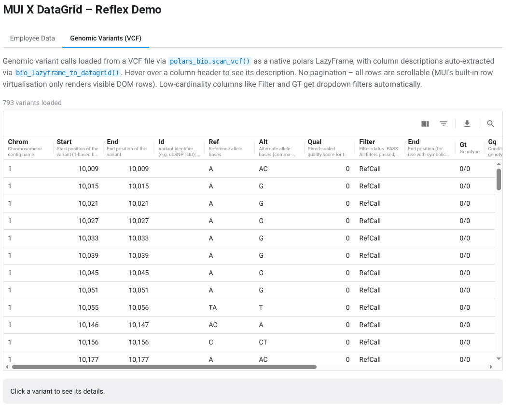
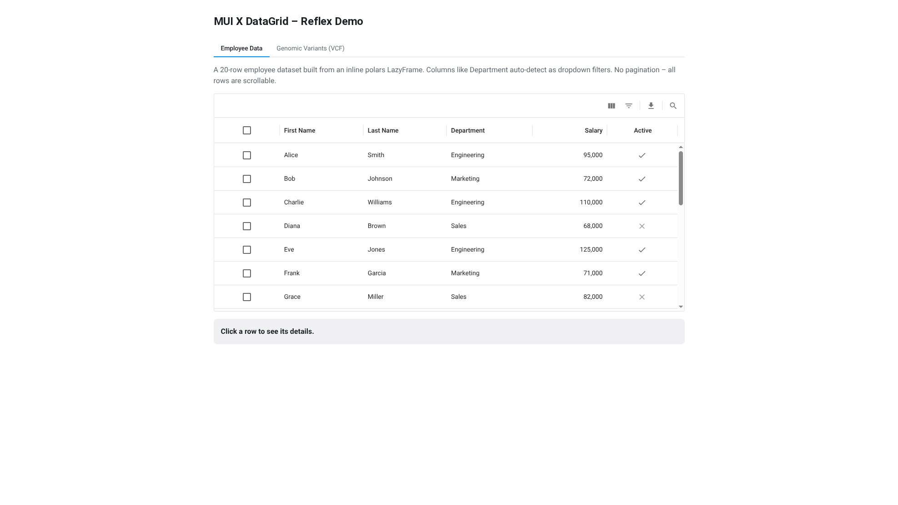

# reflex-mui-datagrid

Reflex wrapper for the [MUI X DataGrid](https://mui.com/x/react-data-grid/) (v8) React component, with built-in [polars](https://pola.rs/) LazyFrame support and optional genomic data visualization via [polars-bio](https://biodatageeks.org/polars-bio/).

[](https://pypi.org/project/reflex-mui-datagrid/)
[](https://pypi.org/project/reflex-mui-datagrid/)
[](https://pypi.org/project/reflex-mui-datagrid/)
[](https://github.com/dna-seq/reflex-mui-datagrid)



## Installation

```bash
uv add reflex-mui-datagrid
```

For CLI usage, you can run the tool as `biogrid` (see CLI section below).

For genomic data support (VCF/BAM files), install with the `[bio]` extra:

```bash
uv add "reflex-mui-datagrid[bio]"
```

Requires Python >= 3.12, Reflex >= 0.8.27, and polars >= 1.0.

## CLI VCF Viewer (No Boilerplate)

The package includes a CLI entrypoint that can launch an interactive viewer
for VCF and other tabular formats. This is the fastest way to explore a VCF
without writing any app code.

Install as a global `uv` tool (with genomic support):

```bash
uv tool install "reflex-mui-datagrid[bio]"
```

This installs both commands:
- `reflex-mui-datagrid` (full name)
- `biogrid` (bio-focused alias)

Open a VCF in your browser:

```bash
reflex-mui-datagrid path/to/variants.vcf
# bio-focused alias
biogrid path/to/variants.vcf
```

Useful options:

```bash
reflex-mui-datagrid path/to/variants.vcf --limit 5000 --port 3005 --title "Tumor Cohort VCF"
# bio-focused alias
biogrid path/to/variants.vcf --limit 5000 --port 3005 --title "Tumor Cohort VCF"
```

The CLI auto-detects file formats by extension and currently supports:
- Genomics (via `polars-bio`): `vcf`, `bam`, `gff`, `bed`, `fasta`, `fastq`
- Tabular: `csv`, `tsv`, `parquet`, `json`, `ndjson`, `ipc`/`arrow`/`feather`

## Quick Start

The fastest way to visualize a polars DataFrame or LazyFrame is the `show_dataframe` helper:

```python
import polars as pl
import reflex as rx
from reflex_mui_datagrid import show_dataframe

df = pl.read_csv("my_data.csv")

def index() -> rx.Component:
    return show_dataframe(df, height="500px")

app = rx.App()
app.add_page(index)
```

That single call handles column type detection, dropdown filters for low-cardinality columns, row IDs, JSON serialization, and the MUI toolbar -- all automatically.

### With State (for reactive updates)

For grids that update in response to user actions, use `lazyframe_to_datagrid` inside a `rx.State` event handler:

```python
import polars as pl
import reflex as rx
from reflex_mui_datagrid import data_grid, lazyframe_to_datagrid

class State(rx.State):
    rows: list[dict] = []
    columns: list[dict] = []

    def load_data(self) -> None:
        lf = pl.LazyFrame({
            "id": [1, 2, 3],
            "name": ["Alice", "Bob", "Charlie"],
            "score": [95, 82, 91],
        })
        self.rows, col_defs = lazyframe_to_datagrid(lf)
        self.columns = [c.dict() for c in col_defs]

def index() -> rx.Component:
    return data_grid(
        rows=State.rows,
        columns=State.columns,
        show_toolbar=True,
        height="400px",
    )

app = rx.App()
app.add_page(index, on_load=State.load_data)
```

## Core Features

- **MUI X DataGrid v8** (Community edition, MIT) with `@mui/material` v7
- **No pagination by default** -- all rows are scrollable; MUI's built-in row virtualisation only renders visible DOM rows, keeping scrolling smooth for large datasets
- **No 100-row limit** -- the Community edition's artificial page-size cap is removed via a small JS patch; pass `pagination=True` to re-enable pagination with any page size
- **`show_dataframe()` helper** -- one-liner to turn any polars DataFrame or LazyFrame into a fully-featured interactive grid
- **Polars LazyFrame integration** -- `lazyframe_to_datagrid()` converts any LazyFrame to DataGrid-ready rows and column definitions in one call
- **Automatic column type detection** -- polars dtypes map to DataGrid types (`number`, `boolean`, `date`, `dateTime`, `string`)
- **Automatic dropdown filters** -- low-cardinality string columns and `Categorical`/`Enum` dtypes become `singleSelect` columns with dropdown filters
- **JSON-safe serialization** -- temporal columns become ISO strings, `List` columns become comma-joined strings, `Struct` columns become strings
- **`ColumnDef` model** with snake_case Python attrs that auto-convert to camelCase JS props
- **Event handlers** for row click, cell click, sorting, filtering, pagination, and row selection
- **Auto-sized container** -- `WrappedDataGrid` wraps the grid in a `<div>` with configurable `width`/`height`
- **Row identification** -- `row_id_field` parameter for custom row ID, auto-generated `__row_id__` column when no `id` column exists

## The `show_dataframe` Helper

`show_dataframe` is designed for polars users who want to quickly visualize a DataFrame without wiring up Reflex state. It accepts a `pl.DataFrame` or `pl.LazyFrame` and returns a ready-to-render component:

```python
from reflex_mui_datagrid import show_dataframe

# Basic usage -- just pass a DataFrame
grid = show_dataframe(df)

# With options
grid = show_dataframe(
    df,
    height="600px",
    density="compact",
    show_toolbar=True,
    limit=1000,                          # collect at most 1000 rows
    column_descriptions={"score": "Final exam score (0-100)"},
    show_description_in_header=True,     # show descriptions as subtitles
    column_header_height=70,             # taller headers for subtitles
)
```

**Parameters:**

| Parameter | Type | Default | Description |
|-----------|------|---------|-------------|
| `data` | `LazyFrame \| DataFrame` | *required* | The polars data to visualize |
| `height` | `str` | `"600px"` | CSS height of the grid container |
| `width` | `str` | `"100%"` | CSS width of the grid container |
| `show_toolbar` | `bool` | `True` | Show MUI toolbar (columns, filters, density, export) |
| `density` | `str \| None` | `None` | `"comfortable"`, `"compact"`, or `"standard"` |
| `limit` | `int \| None` | `None` | Max rows to collect from LazyFrame |
| `column_descriptions` | `dict \| None` | `None` | `{column: description}` for header tooltips |
| `show_description_in_header` | `bool` | `False` | Show descriptions as subtitles in headers |
| `column_header_height` | `int \| None` | `None` | Header height in px (useful with description subtitles) |
| `checkbox_selection` | `bool` | `False` | Show checkbox column for row selection |
| `on_row_click` | `EventHandler \| None` | `None` | Handler called when a row is clicked |

**When to use `show_dataframe` vs `lazyframe_to_datagrid`:**

- Use `show_dataframe` for quick prototyping, static dashboards, or when you just want to see your data.
- Use `lazyframe_to_datagrid` inside `rx.State` when the grid data needs to change in response to user actions (filtering server-side, loading different files, etc.).

## Genomic Data Visualization

[polars-bio](https://biodatageeks.org/polars-bio/) is a bioinformatics library that reads genomic file formats (VCF, BAM, GFF, FASTA, FASTQ, and more) as native polars LazyFrames. Since `show_dataframe` accepts any polars LazyFrame, you get an interactive genomic data browser in two lines of code -- no boilerplate needed.


### Extra Dependencies

Install with the `[bio]` extra to pull in polars-bio:

```bash
uv add "reflex-mui-datagrid[bio]"
```

This adds [polars-bio](https://pypi.org/project/polars-bio/) >= 0.23.0, which provides `scan_vcf()`, `scan_bam()`, `scan_gff()`, and other genomic file readers -- all returning standard polars LazyFrames.

If you only want quick interactive exploration, the CLI is the simplest option:

```bash
reflex-mui-datagrid variants.vcf
```

### Quick VCF Visualization (two lines)

Because `polars_bio.scan_vcf()` returns a polars LazyFrame, you can pass it straight to `show_dataframe`:

```python
import polars_bio as pb
from reflex_mui_datagrid import show_dataframe

lf = pb.scan_vcf("variants.vcf")  # polars LazyFrame

def index() -> rx.Component:
    return show_dataframe(lf, density="compact", height="540px")
```

That is all you need -- column types, dropdown filters for low-cardinality fields like `filter` and genotype, row IDs, and the MUI toolbar are all set up automatically.

### VCF with Column Descriptions from Headers

For richer display, `bio_lazyframe_to_datagrid` automatically extracts column descriptions from VCF INFO/FORMAT headers and shows them as tooltips or subtitles in the column headers:

```python
import polars_bio as pb
import reflex as rx
from reflex_mui_datagrid import bio_lazyframe_to_datagrid, data_grid

class State(rx.State):
    rows: list[dict] = []
    columns: list[dict] = []

    def load_vcf(self) -> None:
        lf = pb.scan_vcf("variants.vcf")
        self.rows, col_defs = bio_lazyframe_to_datagrid(lf)
        self.columns = [c.dict() for c in col_defs]

def index() -> rx.Component:
    return data_grid(
        rows=State.rows,
        columns=State.columns,
        show_toolbar=True,
        show_description_in_header=True,  # VCF descriptions as subtitles
        density="compact",
        column_header_height=70,
        height="540px",
    )

app = rx.App()
app.add_page(index, on_load=State.load_vcf)
```

`bio_lazyframe_to_datagrid` merges three sources of column descriptions:
1. **VCF specification** -- standard fields (chrom, start, ref, alt, qual, filter, etc.)
2. **INFO fields** -- descriptions from the file's `##INFO` header lines
3. **FORMAT fields** -- descriptions from the file's `##FORMAT` header lines

## Server-Side Scroll-Loading (Large Datasets)

For datasets too large to load into the browser at once (millions of rows), the `LazyFrameGridMixin` provides a complete server-side solution with scroll-driven infinite loading, filtering, and sorting -- all backed by a polars LazyFrame that is never fully collected into memory.

### Quick Example

```python
from pathlib import Path
from reflex_mui_datagrid import LazyFrameGridMixin, lazyframe_grid, scan_file

class MyState(LazyFrameGridMixin, rx.State):
    def load_data(self):
        lf, descriptions = scan_file(Path("my_genome.vcf"))
        yield from self.set_lazyframe(lf, descriptions)

def index() -> rx.Component:
    return rx.box(
        rx.button("Load", on_click=MyState.load_data, loading=MyState.lf_grid_loading),
        rx.cond(MyState.lf_grid_loaded, lazyframe_grid(MyState)),
    )
```

That's it -- you get server-side filtering, sorting, and infinite scroll-loading with no additional wiring.

### `scan_file` -- Auto-Detect File Format

`scan_file` opens any supported file as a polars LazyFrame and extracts column descriptions where available:

```python
from reflex_mui_datagrid import scan_file

# VCF -- auto-extracts column descriptions from headers
lf, descriptions = scan_file(Path("variants.vcf"))

# Parquet -- no descriptions, but LazyFrame is ready
lf, descriptions = scan_file(Path("data.parquet"))

# Also supports: .csv, .tsv, .json, .ndjson, .ipc, .arrow, .feather
```

### `LazyFrameGridMixin` -- State Mixin

`LazyFrameGridMixin` is a Reflex **state mixin** (`mixin=True`) that provides all the state variables and event handlers needed for server-side browsing. Inherit from it **and** `rx.State` in your state class -- each subclass gets its own independent set of `lf_grid_*` vars, so multiple grids on the same page do not interfere:

```python
class MyState(LazyFrameGridMixin, rx.State):
    # Your own state vars
    file_available: bool = False

    def load_data(self):
        lf, descriptions = scan_file(Path("data.parquet"))
        yield from self.set_lazyframe(lf, descriptions, chunk_size=500)
```

**State variables** (all prefixed `lf_grid_` to avoid collisions):

| Variable | Type | Description |
|----------|------|-------------|
| `lf_grid_rows` | `list[dict]` | Currently loaded rows |
| `lf_grid_columns` | `list[dict]` | Column definitions |
| `lf_grid_row_count` | `int` | Total rows matching current filter |
| `lf_grid_loading` | `bool` | Loading indicator |
| `lf_grid_loaded` | `bool` | Whether data has been loaded |
| `lf_grid_stats` | `str` | Last refresh timing info |
| `lf_grid_selected_info` | `str` | Detail string for clicked row |

**`set_lazyframe` parameters:**

| Parameter | Type | Default | Description |
|-----------|------|---------|-------------|
| `lf` | `pl.LazyFrame` | *required* | The LazyFrame to browse |
| `descriptions` | `dict[str, str] \| None` | `None` | Column descriptions for tooltips |
| `chunk_size` | `int` | `200` | Rows per scroll chunk |
| `value_options_max_unique` | `int` | `500` | Max distinct values for dropdown filter (queried from full dataset) |

### `lazyframe_grid` -- Pre-Wired UI Component

Returns a `data_grid(...)` with all server-side handlers already connected:

```python
from reflex_mui_datagrid import lazyframe_grid, lazyframe_grid_stats_bar, lazyframe_grid_detail_box

def my_page() -> rx.Component:
    return rx.fragment(
        lazyframe_grid_stats_bar(MyState),   # row count + timing bar
        lazyframe_grid(MyState, height="600px"),
        lazyframe_grid_detail_box(MyState),  # clicked row details
    )
```

**`lazyframe_grid` parameters:**

| Parameter | Type | Default | Description |
|-----------|------|---------|-------------|
| `state_cls` | `type` | *required* | Your state class inheriting `LazyFrameGridMixin` |
| `height` | `str` | `"600px"` | CSS height |
| `width` | `str` | `"100%"` | CSS width |
| `density` | `str` | `"compact"` | Grid density |
| `column_header_height` | `int` | `70` | Header height in px |
| `scroll_end_threshold` | `int` | `260` | Pixels from bottom to trigger next chunk |
| `show_toolbar` | `bool` | `True` | Show MUI toolbar |
| `show_description_in_header` | `bool` | `True` | Show column descriptions as subtitles |
| `debug_log` | `bool` | `True` | Browser console debug logging |
| `on_row_click` | `EventHandler \| None` | `None` | Override default row-click handler |

### Multiple Independent Grids

Because `LazyFrameGridMixin` is a Reflex mixin (`mixin=True`), you can have multiple independent grids on the same page -- each subclass gets its own `lf_grid_*` state vars:

```python
class ParquetGrid(LazyFrameGridMixin, rx.State):
    def load(self):
        yield from self.set_lazyframe(pl.scan_parquet("data.parquet"))

class CsvGrid(LazyFrameGridMixin, rx.State):
    def load(self):
        yield from self.set_lazyframe(pl.scan_csv("data.csv"))

# ParquetGrid.lf_grid_rows and CsvGrid.lf_grid_rows are independent
```

### How It Works

1. `set_lazyframe` stores the LazyFrame in a module-level cache (never serialised into Reflex state), computes the schema, total row count, and low-cardinality filter options from a bounded sample.
2. Only the first chunk of rows is collected and sent to the frontend.
3. As the user scrolls near the bottom, `handle_lf_grid_scroll_end` collects the next chunk and appends it.
4. Filter and sort changes reset to page 0 and re-query the LazyFrame with Polars expressions -- no full-table collect.

## Running the Example

The project uses [uv workspaces](https://docs.astral.sh/uv/concepts/projects/workspaces/). The example app is a workspace member with a `demo` entrypoint:

```bash
uv sync
uv run demo
```

The demo has three tabs:

| Tab | Description |
|-----|-------------|
| **Employee Data** | 20-row inline polars LazyFrame with sorting, dropdown filters, checkbox selection |
| **Genomic Variants (VCF)** | 793 variants loaded via `polars_bio.scan_vcf()`, column descriptions from VCF headers |
| **Full Genome (Server-Side)** | ~4.5M variants with server-side scroll-loading, filtering, and sorting via `LazyFrameGridMixin` |



## API Reference

See [docs/api.md](docs/api.md) for the full API reference.

## License

MIT
